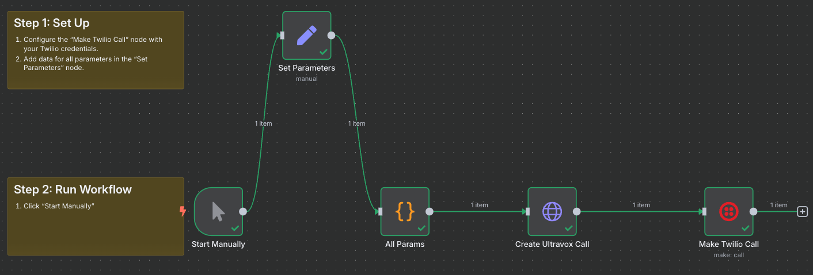

# No Code Outbound Caller (n8n + Twilio)

An Ultravox agent that makes outbound calls using n8n and Twilio. No coding is required. The agent is built in the Ultravox web application and n8n is used for populating call parameters and triggering the outbound calls.

## Create Agent

1. Sign-in to [https://app.ultravox.ai](https://app.ultravox.ai).
2. [Create a new Agent](https://app.ultravox.ai/agents/new).
3. Configure the agent with the following settings:

* **Agent Name** → `Outbound-Caller`
* **Tools** → Select the `hangUp` tool.
* **First Speaker** → Under Settings > First Speaker set "First Speaker" to `User`. Click "Apply".
* **System Prompt** → Copy and paste the following:
```bash
You are Carter. Your mission in life: deliver heart warming voice messages to people and make their day.

You are calling {{name}}. You are to deliver this message: {{message}}. The message is from {{sender}}.

After you deliver the message, wait for the conversation to get to a natural ending place and then call the "hangUp" tool.
```

4. Click "Save".

You just created an agent and it will appear in your [list of agents](https://app.ultravox.ai/agents). Make note of the Agent ID. This will be used in n8n.

## Configure n8n Workflow
1. Sign-in to [n8n](https://n8n.io).
2. Create a new Workflow.
3. Import the included `Ultravox Agent Call (Twilio).json` file.



4. Configure the workflow:
- **Twilio Credentials** → If you haven't done so, configure your [Twilio credentials in n8n](https://docs.n8n.io/integrations/builtin/credentials/twilio/)
- **Configure Node:  Make Twilio Call** → Open this node and configure it to connect with your Twilio credentials.
- **Configure Node:  Set Parameters** → Add values for everything:
   - Ultravox API Key
   - Ultravox Agent ID → This is the uuid we got above when creating the agent.
   - Twilio Phone Number → This is the phone number that will be used to make outbound calls. Must start with `+`. E.g. `+12065551212`.
   - First Name → The first name of the person the agent is calling. This is passed into the system prompt during call creation time using the `{{name}}` param.
   - Phone Number → The number of the person the agent is calling. Must start with `+`.
   - Sender Name → The name of the person sending the message. Passed in as the `{{sender}}`.
   - Message → The message the agent will deliver. `{{message}}` param in the system prompt.

5. Make the call by using the "Start Manually" node.

## Requirements

- **n8n** for workflow orchestration
- **Twilio Phone Number** for outbound calls